# PC-F配列

## 作った動機
- 新下駄配列のような、快適な打鍵感を、万人に体験できるようにしたい
- パソコンでもフリックのようなサクサク打鍵感を目指したい (PCでFlick → PC-F配列)

## 特徴
- 新下駄配列のような中指同時シフトに似た、行(あいう…)と段(あかさ…)を同時に打鍵するタイプの、**行段系・同時打鍵系配列**。
- 新下駄配列などの記憶の大変さを軽減させつつ、同時打鍵系のサクサクとした打鍵感、音節に合った打鍵感を体験できるように制作。
- スマホのフリック配列に慣れたユーザが馴染みやすいよう、右手中央にフリックでいうところの「↑←↓→」を「ういおえ」として配置し、すぐにルールがわかるよう設計。
- SHIFTや親指シフトなどのシフトキーは使用せず、左右の同時シフトのみ。ただし、文字キー同時打鍵シフトは、連続シフト推奨。（同じ行段を押したまま、スムーズに打鍵できるように。「おおさか」などが打ちやすい。設定法はエミュレータに依る。）
- フリックに似た配列での覚えやすさを最優先しつつも、「そう」や「しゅう」などのよく使う組み合わせが打ちやすいように配置。

## 基本ルール

※ 以下、定義はすべてyabファイル、やまぶきR設定ファイルに記載。連続シフト推奨。（yabファイル中の `<j>` は jキーとの同時打鍵を示す。 ）

- 左手側の「あ」と「か」をそれどれ単独で押す → あか
- 左手側の「か」と右手側の「う」を同時押し → く
- 左手側の「は」と右手側の「お」を同時押し → ほ
- 左手側の「さ」と右手側の「ゃ」を同時押し → しゃ
- 左手側の「ば」と右手側の「ょ」を同時押し → びょ
- 左手側の「フ」と右手側の「い」を同時押し → フィ
- 左手側の「小」と右手側の「あ」を同時押し → ぁ
- 左手側の「、」と右手側の「う」を同時押し → 。

以上すべて、右手側の「ういおえ」を「↑←↓→」に見立てると、フリックに準拠。

## 詳細ルール（フリックと異なる点）

- 右手側の「ゃゅょ」は、母音と別に配置。
- 右手側の「ゃゅょ」を単独打鍵すると、「やゆよ」が入力される。（これにより、やの段を省略。）
- 右手側の「ん」は、単純に「ん」が入力される。「BS」と「ー」も同様だが、「ー」は「う」との同時押しで「～」になる。
- 左手側の「フ・ヴ・が・ば」は、濁音と半濁音の段に対応し、これにより濁点と半濁点の定義は省略。（必要なら空きキーに割り当てるても良いが、濁音・半濁音はもとの段の近くにあり覚えやすいので、基本的に再定義は不要。）
- 「、」以外の特殊記号はすべて、フリックのように複数の同時打鍵で別の記号が打てる。詳しくはyabファイルを参照。
- 「”」は濁点ではなくダブルクオーテーション。同様に、「ー」は伸ばし棒、「、」は読点、「。」は句点、「BS」はバックスペース。
- 数字は現在未定義だが、上記記号のように拡張したり、通常のSHIFTや親指シフトに割り当てるなども可。

## 打鍵している様子

(誠意準備中)